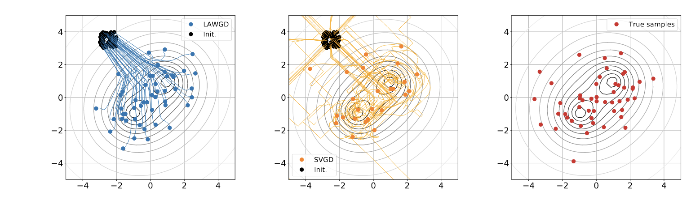

### Summary

I have been attending ICML virtually this year - a few papers caught my attention, mostly because they tackle issues related to what I am currently thinking about: generative models.

Summarizing a paper is a great exercise: putting thoughts into words requires to reach a substantial level of understanding of the paper. Some amount of litterature review is needed to understand the problem setting as well as previous work, which can help to form a high level mental image of the field. Moreover, unlike for your own papers, you can be as vocal as you want about potential weaknesses of the contributions, which help put things in perspective.

For that reason, I summarized two papers presented in ICML 2021: *Conjugate Energy Based Models*, and *Generative Particle Variational Inference via Estimation of Functional Gradients*. I focused on explaining the initial motivation and the high-level structure of the algorithm, and purposely skipped many details and training tricks described at length in the papers.

Finally, I also included a list of other papers that I enjoyed, but did not summarize.

### [Conjugate Energy Based models (CEBM)](http://proceedings.mlr.press/v139/wu21a.html)
TL;DR: CEBMs are Latent variables energy-based models that are trained by comparing structure in latent variable ($z \in \mathbb R^K$) space instead of observed variable space ($x \in \mathbb R^d, d \gg K$). Authors argue that comparing similarities in latent variable space is better as latent variables contain less variability coming from irrelevant noise.

*Differences between VAEs and CEBMs. Picture credits: CEBM paper.*

#### Background of Latent variable generative models
This article introduces a new form of latent energy based models (LEBM). LEBMs are models of the form
$$p(x, z) = \frac{e^{-E_\theta(x, z)}}{Z(\theta)}$$

Fitting an LEBMs against some observed data $\{x^{(i)}\}_{i=1}^{N}$ is usually done using [contrastive divergence](https://www.cs.toronto.edu/~hinton/absps/tr00-004.pdf), which is a twist on approximate gradient-based Likelihood optimization with faster effective runtime. Energy based models are praised for their high flexibility: any structure on the observed and latent variables can be specified through the energy function $E$.

#### Structure of CEBMs

Conditional Energy Based Models (introduced in the paper) define an energy $E_\theta(x, z)$ that ensures:

- A parametrized conditional $p(x \mid z) \propto e^{\left \langle T_\theta(x), \eta(z) \right \rangle} (\eta(z) \in \mathbb R^H, H \sim K \ll d)$ (with untractable normalizing constant). 
- A posterior $p(z \mid x)$ made tractable thanks to a conjugacy trick, allowing for cheap inference.
- A parametrized prior-like bias on z, $B_\lambda(z)$ included in the energy $E(x, z)$.

  
The likelihood $p(x)$ of CEBM can be shown to be of the form $e^{-E(x)}/Z$, with E known analytically. Due to the unknown normalizing constant $Z$, (it is an EBM...), exact ML/Free-energy based learning is impossible, and as explained above, one must resort to training using contrastive divergence + MCMC (in their case using Stochastic Gradient Langevin Dynamics).
  
  
#### VAEs vs CEBMs: structural differences in the Bregman Divergence sense
  

One major alternative to LEBMs are Variational Auto-Encoders (VAEs). VAEs define a joint density $p(x, z)$ of the form
$$p(x, z) = p(x | z) p(z) = \mathcal N(\mu_\theta(z), \sigma^2 I) \mathcal N(0, 1)$$ that is analytically available, and thus can be trained using approximate free-energy maximization. VAEs, define an encoder network $\mu_\theta(x)$ that approximates the posterior $p(z \mid x) = \mathcal N(\mu_\theta(x), \sigma^2 I)$.

Authors argue that VAEs compare structure in output variable space $x$, while CEBMs compare structure in latent variable space $z$. To justify that, authors rely on the duality characteristics of exponential families. Without entering in too much details, the log-likelihood $\log p(x \mid \theta)$ of an exponential family member with sufficient statistic $t(x)$, natural parameter $\eta$, (convex) log-normalizer $A(\eta)$ and mean parameter $\mu$ can be written as:
$$ \log p(x \mid \theta) = <t(x), \eta> - A(\eta) = -D_A(t(x), \mu) + A^\star(t(x))$$
Where $A^\star$ is the fenchel conjugate of $A$, and $D_A$ is the Bregman divergence associated to $A$. Optimizing over $\eta$ is the same as optimizing over $\mu$, and we see that maximizing the data likelihood is the same as minimizing the Bregman Divergence $D_A$ between $t(x)$ and $\mu$.

Now, applying this to both VAEs and GEBMs, we get:

$$ \log p_{\text{VAE}}(x, z) = D_A(x, \mu_\theta(z)) +E(x) + E_\lambda(z)$$
$$ \log p_{\text{CEBM}}(x, z) = D_B(\eta(z), \mu_\theta(x)) - B^\star(\eta(z))  + E_{\theta, \lambda}(z)$$

Where $B$ is a tractable log-normalizer of the posterior $p(z \mid x)$. Note that in the second line, $\mu_\theta$ is the mean parameter associated with the CEBM posterior, while in the first line $\mu_\theta$ is the natural parameter of the VAE conditional $p(x | z)$. Arguably, the latent sufficient statistic ($\eta(z)$) space $\mathbb R^H$, on which $D_B$ is defined is of similar complexity than the latent variable space $\mathbb R^H$, and it is fair to say that CEBMs carry out comparison in latent space, wherease VAEs do it in output space.

  
### [Generative Particle Variational Inference via Estimation of Functional Gradients](http://proceedings.mlr.press/v139/ratzlaff21a.html)
#### Background on particle variational inference
  Particle Variational Inference (ParVI) methods are methods which propose to solve the problem of drawing samples from target probability measure with density $p(x)$ known up to a normalization factor. The solution of ParVI methods is to transport a set of particles $\{x^{(i)}_0\}_{i=1}^{N}$ (usually i.i.d, samples from a fixed density $q_0$) "towards" regions of target high density. As I see it, the rationale for it is that ParVI methods can be seen as generating a path $t \longmapsto \sum_{i=1}^{N} \delta_{x^{(i)}_t}$ that should approximate a gradient flow path $D(\cdot \mid \mid p(x))$ starting from $q_0$. Typically, D is the KL divergence, as proposed in the famous Stein Variational Gradient Descent paper.
  
The main limitation of ParVI methods is that the number of samples N is fixed upfront: there is no way to sample from our approximated target, whose existence we assume when the algorithm converges. Thus, authors in this paper propose to learn an implicit generative model $q_\eta = (f_\eta)_{\#} q_0$

#### Generative particle VI: previous work
[Liu & Wang (2016)](https://arxiv.org/pdf/1611.01722.pdf) proposed to make particle VI methods generative. In their paper, there is not a deterministic set of paritcles anymore: these particles are replaced with an implicit generative model $(f_\eta)_\# p_0$ trained as follows:

At each time $t$:

 1. draw $\{\xi_t^{(i)}\}_{i=1}^{N}$ from $p_0$, comute $x_t^{(i)} = f_\eta(\xi_t^{(i)})$ for all $i$.
 2. compute SVGD descent function $\phi^\star$, update $x_{t + 1} := x_t^{(i)} - \epsilon \phi^\star(x_t^{(i)})$
 3. update $\eta$ to map $\xi_t^{{(i)}}$ to $x_{t+1}^{(i)}$

*Particle VI methods draw samples from a target density $p(x)$ (gray level
lines) by transporting initial samples , usually using gradient flow dynamics.
Pictured: Stein Variational Gradient Descent trajectories, and LAWGD
trajectories (picture credits: [SVGD as a gradient flow of the Chi-Squared divergence](https://arxiv.org/pdf/2006.02509.pdf)).*
 
#### Contributions
  
Authors of the GPVI paper argue that the algorithm above has a flaw: it still uses a **nonparametric** descent direction $\phi^\star$, while it should take into acount the generative model parametrization $x = f_\eta(z)$, which implies that not all perturbations $(id + \epsilon f)_\# p_t$ can be spanned by the model.  Additional tricks are then ensured to make the computations tractable.

One of the main argument of why this method is "principled" is the use of functional gradient (e.g. a gradient of a functional defined in a hilbert space $\mathcal H$ of functions, set to be a RKHS in the paper) to compute the "steepest descent" direction of $\mathcal J(f_\eta) = \text{KL}((f_\eta)_\#q_0 \mid \mid p)$. The update on the parameters $\eta$ relies on this steepest direction in the following way:

1. Compute a nonparametric functional gradient $\nabla_f J(f_\eta) := \nabla (f \longmapsto \mathcal J(f))|_{f = f\eta}$
2. "Backpropagate" the gradient to parameter space using the formula: $\nabla_\eta \mathcal J(f_\eta) := \mathbb E_z \left \lbrack \frac{\partial f_\eta(z)}{\partial \eta}\nabla_f \mathcal J(f_\eta)(z) \right \rbrack$

However, I could not figure how they got the update rule for the parameter, which does not seem to be a simple application of the chain rule. In addition, the use of an RKHS when computing $\nabla_f J$ seems to imply that $\{f_\eta \mid \eta \in \mathbb R^d\} = \mathcal H$ which is not the case.
  
### Other papers that I liked

- [Oops I Took A Gradient: Scalable Sampling for Discrete Distributions](http://proceedings.mlr.press/v139/grathwohl21a.html): great delivery by Grathwohl, introducing a more efficient alternative to Gibbs Sampling with examples on Ising models.
- [Two-way kernel matrix puncturing: towards resource-efficient PCA and spectral clustering](https://icml.cc/virtual/2021/poster/10275TLDR). TLDR: you don't need your whole gram matrix when doing spectral clustring (in the M.O.G case). Continuation of a line of work from Romain, see [Random Matrix Theory Proves that Deep Learning Representations of GAN-data Behave as Gaussian Mixtures](https://arxiv.org/pdf/2001.08370.pdf), and see [kernel  spectral  clustering  of  large  dimensional  data](https://arxiv.org/pdf/1510.03547.pdf) for an analysis of a wider class of kernel matrices.
- [Scalable Variational Gaussian Processes via Harmonic Kernel Decomposition](https://icml.cc/virtual/2021/poster/9537). Because kernels, and because it is the first time I heard of this harmonic kernel decomposition, a.k.a some form of Fourier-based orthogonal direct sum decomposition of a RKHS.
